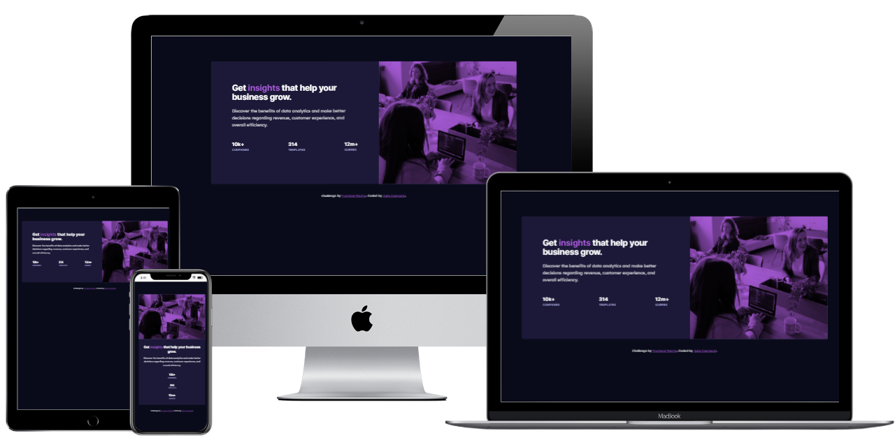

# Frontend Mentor - Stats preview card component solution

This is a solution to the [Stats preview card component challenge on Frontend Mentor](https://www.frontendmentor.io/challenges/stats-preview-card-component-8JqbgoU62). Frontend Mentor challenges help you improve your coding skills by building realistic projects. 

## Table of contents

- [Overview](#overview)
  - [The challenge](#the-challenge)
  - [Screenshot](#screenshot)
  - [Links](#links)
- [My process](#my-process)
  - [Built with](#built-with)
  - [What I learned](#what-i-learned)
  - [Continued development](#continued-development)
  - [Useful resources](#useful-resources)
- [Author](#author)
- [Acknowledgments](#acknowledgments)

**Note: Delete this note and update the table of contents based on what sections you keep.**

## Overview

### The challenge

Users should be able to:

- View the optimal layout depending on their device's screen size

### Screenshot

### Links

- Solution URL: [https://github.com/ninjulia/FEM_Stats-Preview-Card](https://github.com/ninjulia/FEM_Stats-Preview-Card)
- Live Site URL: [https://ninjulia.github.io/FEM_Stats-Preview-Card/](https://ninjulia.github.io/FEM_Stats-Preview-Card/)

## My process

### Built with

- Semantic HTML5 markup
- CSS custom properties
- Flexbox
- Mobile-first workflow

### What I learned

It's been a while since I coded anything without a framework. For this, I relied heavily on Flexbox to set the layouts, starting with the mobile view.  For the header image, I leveraged background-blend-mode:multiply, which resulted in a slightly richer tone compared to the comp - overall I think it was an improvement.  Leveraging the background-image property did leave me without the option to include alt-text, but for this situation, the image is purely decorative.

### Continued development

Ideally, this would have been a great chance to use CSS Grid. I think this may have been a better way to handle the image alignment.  I used my best judgment on the padding since I did not have access to the Figma files. I also used pixel values where ideally I would use rems.  I also used longhand notation on the background and flexbox properties, in a production environment I would condense those down.  

### Useful resources

- [Thank god for CSS-Tricks' Flexbox Guide](https://css-tricks.com/snippets/css/a-guide-to-flexbox/) - So so helpful for this

## Author

- Website - [becausejulia.com](https://www.becausejulia.com)
- Frontend Mentor - [@ninjulia](https://www.frontendmentor.io/profile/ninjulia)
